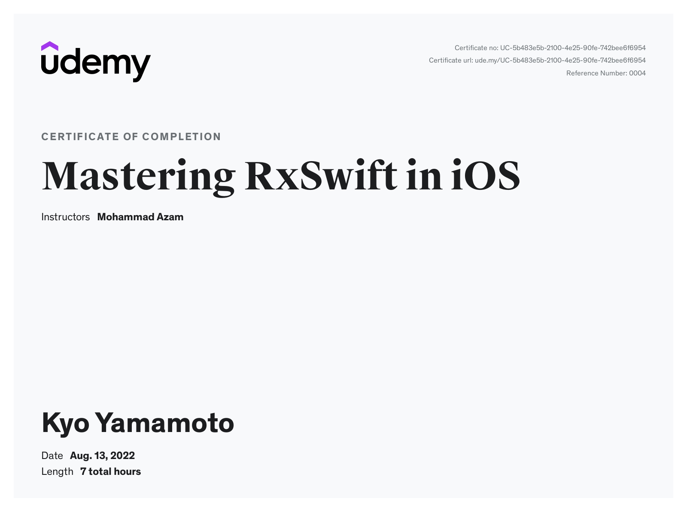
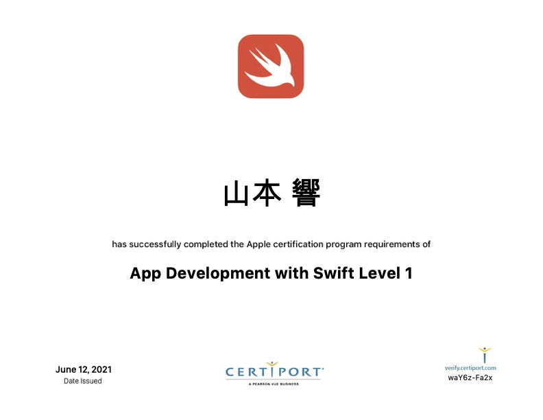
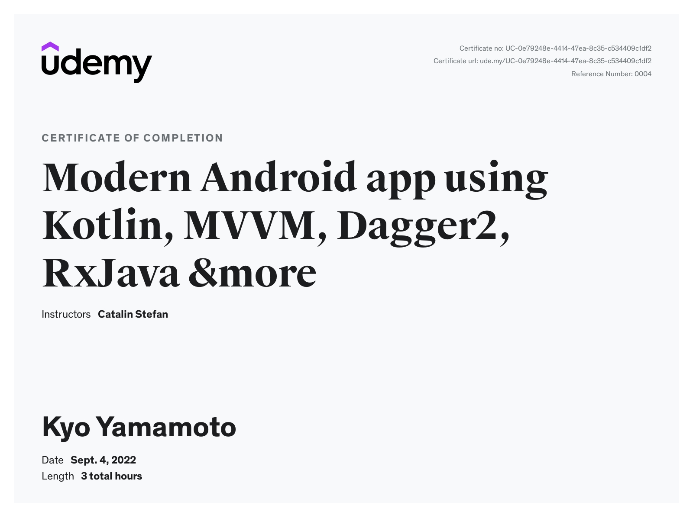

## Hello, folks! 
<p>


- 🏆 I'm a Kodeco(Raywenderlich), Hacking With Swift, Medium, Kavsoft and designcode Founding Member.
- ⭐️ I’m currently working on creating iOS and Android Apps.
- 🌱 I’m currently on my way to Master Mobile App Development.
- 📫 How to contact with me: mynameisyamamotodesu@gmail.com
- 🔗 My Linkedin Profile: [Linkedin](https://www.linkedin.com/in/kyo-yamamoto-a2ab50239)
- 🔗 My Resume: [CV](https://www.kickresume.com/cv/ZWKvXV/)


### My iOS and Android Certificates 🎖

iOS Development Security  | The Swift Arcade Professional iOS Development Course - UIKit  |  Mastering RxSwift in iOSMastering RxSwift in iOS
:-------------------------:|:-------------------------:|:-------------------------:
 |  |  

 
Grocery Shopper App using Realm, SwiftUI in iOS|  App Development with Swift Level 1
:-------------------------:|:-------------------------:
  | 
 
 
Modern Android app using Kotlin, MVVM, Dagger2, RxJava &moreModern   |  Complete Kotlin Coroutines development course 2022 
:-------------------------:|:-------------------------:
 |   

### My books read for iOS and Android 📚

RxSwift: Reactive Programming with Swift (Fourth Edition) | Combineをはじめよう 
:-------------------------:|:-------------------------:
 |   
 
Effective Swift | RxSwift研究読本3 ViewModel設計パターン入門 | RxSwift研究読本2 エラーハンドリング編 | RxSwift研究読本1 基礎編 |
:-------------------------:|:-------------------------:|:-------------------------:|:-------------------------:
  |    |  |  
 
App Development with Swift
:-------------------------:


実践 Android Data Binding  
:-------------------------:
 

### Github Stats 🥇 
<!--START_SECTION:waka-->


**🐱 My GitHub Data** 

> 📦 768.9 kB Used in GitHub's Storage 
 > 
> 🏆 584 Contributions in the Year 2023
 > 
> 🚫 Not Opted to Hire
 > 
> 📜 253 Public Repositories 
 > 
> 🔑 0 Private Repositories 
 > 
**I'm an Early 🐤** 

```text
🌞 Morning                435 commits         █████░░░░░░░░░░░░░░░░░░░░   21.49 % 
🌆 Daytime                863 commits         ███████████░░░░░░░░░░░░░░   42.64 % 
🌃 Evening                698 commits         █████████░░░░░░░░░░░░░░░░   34.49 % 
🌙 Night                  28 commits          ░░░░░░░░░░░░░░░░░░░░░░░░░   01.38 % 
```
📅 **I'm Most Productive on Sunday** 

```text
Monday                   326 commits         ████░░░░░░░░░░░░░░░░░░░░░   16.11 % 
Tuesday                  167 commits         ██░░░░░░░░░░░░░░░░░░░░░░░   08.25 % 
Wednesday                210 commits         ███░░░░░░░░░░░░░░░░░░░░░░   10.38 % 
Thursday                 127 commits         ██░░░░░░░░░░░░░░░░░░░░░░░   06.27 % 
Friday                   190 commits         ██░░░░░░░░░░░░░░░░░░░░░░░   09.39 % 
Saturday                 486 commits         ██████░░░░░░░░░░░░░░░░░░░   24.01 % 
Sunday                   518 commits         ██████░░░░░░░░░░░░░░░░░░░   25.59 % 
```


📊 **This Week I Spent My Time On** 

```text
🕑︎ Time Zone: Asia/Tokyo

💬 Programming Languages: 
XML                      9 hrs 47 mins       ████████████████░░░░░░░░░   62.82 % 
Kotlin                   2 hrs 15 mins       ████░░░░░░░░░░░░░░░░░░░░░   14.48 % 
Swift                    1 hr 59 mins        ███░░░░░░░░░░░░░░░░░░░░░░   12.78 % 
Groovy                   55 mins             █░░░░░░░░░░░░░░░░░░░░░░░░   05.96 % 
Gradle                   16 mins             ░░░░░░░░░░░░░░░░░░░░░░░░░   01.74 % 

🔥 Editors: 
Android Studio           13 hrs 35 mins      ██████████████████████░░░   87.22 % 
Xcode                    1 hr 59 mins        ███░░░░░░░░░░░░░░░░░░░░░░   12.78 % 

💻 Operating System: 
Mac                      15 hrs 34 mins      █████████████████████████   100.00 % 
```

**I Mostly Code in Swift** 

```text
Swift                    142 repos           █████████████████████░░░░   82.08 % 
Kotlin                   25 repos            ████░░░░░░░░░░░░░░░░░░░░░   14.45 % 
Objective-C              3 repos             ░░░░░░░░░░░░░░░░░░░░░░░░░   01.73 % 
HTML                     2 repos             ░░░░░░░░░░░░░░░░░░░░░░░░░   01.16 % 
Java                     1 repo              ░░░░░░░░░░░░░░░░░░░░░░░░░   00.58 % 
```


**Timeline**


 Last Updated on 30/03/2023 01:25:22 UTC
<!--END_SECTION:waka-->


## 🙈For My Notes

 
## ■ iOS and Android
### 🧑‍🔧 Monday ~ Friday
* [Designcode(half-hour)](https://designcode.io/tutorials/) 7:30 ~ 8:00 
* [Hackingwithswift(half-hour)](https://www.hackingwithswift.com/) 8:30 ~ 9:00
* [Medium](https://medium.com/)

 
### 🫖 Saturday and Sunday
【🧑‍💻AM】
* [Designcode(half-hour)](https://designcode.io/tutorials/) 7:30 ~ 8:00 
* [Udemy(1 hour)](https://www.udemy.com/) 8:30 ~ 9:20 
* [Google-codelabs(half-hour)](https://codelabs.developers.google.com/codelabs) 9:30 ~ 10:30

【🧑‍💻PM】
* [Hackingwithswift(half-hour)](https://www.hackingwithswift.com/) 
* [Kavsoft(1 hour)](https://www.kodeco.com/home)
* Youtube(1 hour)
* [Medium](https://medium.com/)
 


----
